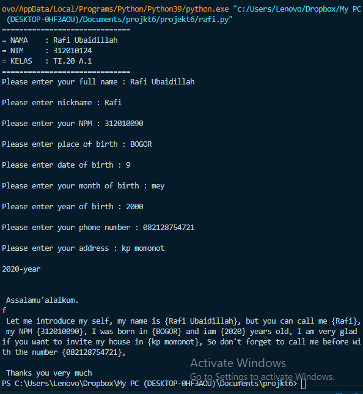

# Tugas ini untuk melengkapi pertemuan ke 6

# Dan menjelaskan project


Nama  : Rafi Ubaidillah
Nim   :312010090
Kelas :TI.A1.20
Tugas :Bahasa Pemrogramman

DAFTAR ISI
| No | Description | Link |
| ----- | ----- | ----- |
| 1 | Tugas Pertemuan 5 | [click here](#pertemuan-5---tugas)
| 2 | Tugas Pertemuan 6 - lab 1 | [click here](#pertemuan-6---lab-1)
| 3 | Tugas pertemuan 6 - lab 1 dan 2 | [click here](#pertemuan-6---lab-1-2)

# Pertemuan 5 - Tugas

Pada pertemuan 5 Bahasa Pemrograman saya diberi tugas oleh Dosen untuk membuat Aplikasi Biodata Python (seperti Gambar dibawah ini)


Berikut **source code** nya atau Klik Link berikut ([pertemuan5 python](pertemuan5.py)):
``` python

print("==============================") <br>
print("= NAMA    : Rafi Ubaidillah   ") <br>
print("= NIM     : 312010124         ") <br>
print("= KELAS   : TI.20 A.1         ") <br>
print("==============================") <br>

`print("Please enter your full name : Risky HariAdi")` <br> 
`fullname=input()` <br>
`print("Please enter nickname : Risky")` <br> 
`nickname=input()` <br>
`print("Please enter your NPM : 312010124")` <br> 
`npm=input()` <br>
`print("Please enter place of birth : BEKASI")` <br> 
`pob=input()` <br>
`print("Please enter date of birth : 13")` <br> 
`date=input()` <br>
`print("Please enter your month of birth : July")` <br> 
`month=input()` <br>
`print("Please enter year of birth : 2000")` <br> 
`year=input()` <br>
`print("Please enter your phone number : 085282024179")` <br>
`phone=input()` <br>
`print("Please enter your address : Perumahan Graha Bagasasi")` <br> 
`address=input()` <br>

`dob=input("2020-year")` <br>

`print("\n\n Assalamu'alaikum. ")` <br>
`print("f\n Let me introduce my self, my name is {Risky HariAdi}, but you can call me {Risky}, my NPM {312010124}, I was born in {BEKASI} and iam {2020} years old, I am very glad if you want to invite my house in {Perumahan Graha Bagasasi}, So don't forget to call me before with the number {085282024179}, \n\n Thanks you very much ")` <br>

Berikut Penjelasannya : <br>

print("please enter your full name : ") <br>
``` <br>
Source code diatas berfungsi untuk mencetak hasil / output berupa **Please enter your full name :** ". <br>
 Untuk menampilkan output string, saya menggunakan *tanda petik dua* didalam fungsi print(), sedangkan jika saya ingin menampilkan output atau hasil berupa angka atau interger saya tidak perlu menggunakan *tanda petik dua*. Contohnya : <br>

```python

print("Nama saya adalah...") <br>
print(1234567) <br>

(Seperti gambar dibawah ini)
```


* Untuk source code berikutnya adalah inputan atau membuat variable. seperti syntax dibawah ini :

`fullname=input()` <br>
``` <br>
**Keterangan** : <br> 
`>Variable adalah sebuah wadah penyimpanan data pada program yang akan akan digunakan selama program itu berjalan. yang berfungsi sebagai variable dalam source code diatas adalah **fullname** . <br>
`>Fungsi **input()** adalah untuk memasukan nilai dari layar console di command prompt, lalu kemudian mengembalikan nilai saat kita menekan tombol enter *(newline)* <br> 
`*(newline)*` <br>

[poto](poto/input.png)<br>

pada gambar di atas, hasil dari inputan tersebut berwarna *hijau* <br>

* Untuk memasukan perintah lain seperti *Nikname, NPM, Place Of Birth, Date Of Birth, Year Of Birth, Phone Number, and Addres* mengikuti perintah sama seperti memasukan *fullname* <br>

* Untuk menghitung rumus saya menggunakan variable *DOB* yaitu 2020 (Tahun sekarang) dikurangin dengan Year of Birt, pada source code berikut : <br>
``` python 


dob=input("2020-year") <br>


``` <br>
Pada syntax/source diatas, saya menggunakan variable (dob) dimana untuk menghitung umur (variable **age** pada output), yaitu dengan rumus pada variable *dob=input("2020-year")* <br>

* langkah kali ini saya akan menampilkan output yang diminta oleh dosen.output pertama yang diminta Dosen adalah menampilkan salam, yaitu dengan mengetikkan syntax/source code berikut : <br>

``` python
print("\n\n Assalamu'alaikum. ")` <br>
``` <br>

``` python

Keterangan : <br>
1. Fungsi **\n** pada source code di atas adalah untuk memberi baris baru / enter / *(newline)* <br>

2. Fungsi print() seperti dijelaskan pada point **Output** diatas
Hasil dari source code diatas adalah seperti gambar dibawah ini : <br>
```


